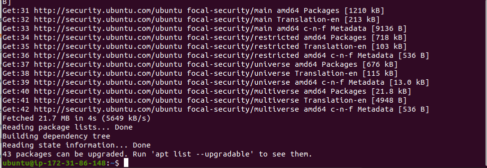

# Project1WebStack
Web Stack Implementation

## Intro
I will be implementing a Web Stack specificically the LAMP Stack in AWS.

## What is a Web Stack

A Web stack is a collection of software applications required for Web development. It generally consist of an operating system (OS), a programming language, a database software and a Web server. There are various Web stacks but I will be using the LAMP stack (commonly used stack).

### LAMP Stack 
LAMP Stack is a time-tested stack used throughout the open source community. It allows programming with a dynamic language used to build and deliver web applications your way.  

The architecture for LAMP stack is structured with Linux (OS) at the lowest level which manages data by communicating with Apache and MySQL. These components use PHP on the presentation layer although PHP sits inside Apache. 

The main advantage of the LAMP stack is its flexibility and efficiency due to its open-source nature and the ability for developers to save time by building on existing code pools. 

L - Linux 

A -Apache

M - MySQL

P - PHP

## (L)inux 
Linux is considered the operating system for this stack. 

### Installing an OS
We will be utilising AWS service (Elastic Cloud Computing - EC2 instance) to create a server. To access this feature, you need to first create an account with AWS or sign in if you have an existing account 

1. Create/Sign-in AWS service account

   or 

    
    
Management Console after signing in 

2. Using the search bar, search and click on EC2

    

3. On the EC2 landing page, click on launch instances

   

Scroll down to choose an AMI specifically the Ubuntu Sever 20.01 LTS (HVM)

   

select t2.micro as the instance type 

click review and launch and then on the next page choose launch. 

Create and save your key-pair pem file in a secure and accessible location. This will be needed to access your server from your local machine. 

   

### Connecting your local machine to your server

1. On your local machine, change directory to the location of your .pem file

    

2. Use ls to verify that you are in the correct directory

3. To avoid getting the error "Bad permissions", change permission for the private key in your terminal. When promted, enter password. 

    

4. Get your public IP address from your instance

    

5. Connect machine to instance from your terminal 

  

6. If connected, your ip-address should show on your terminal 

## (A)pache 

Apache is the ------

### Installing Apache 

1. On your terminal, update your system using apt update 

   

 2. Run the Apache package installation 

        

3. Verify Apache is running on the OS

       

if it is running, the active should be green 

        

To receive traffic by the Web Server, you need to open/allow TCP port 80 on your instance by adding it to the security group inbound rule. 

4. On your instance, go to the security group tab and edit the inbound rules

   

Add the HTTP, TCP port 80 and allow source from anywhere by using 0.0.0.0

    

5. Verfiy access to server locally by running the curl command

      

6. verify access through the web browser using your public IP address

If connected, you should get the below image 

    

## (M)ySQL

Database server ........

### Installing MySQL 

1. On your terminal run the sudo apt install command 

2. Run security script to remove insecure default settings and lock down access to your database system 

You will be asked to validate password component, I recommend typing "N" then press enter

You will be asked to set a password for the root user (this is the database root user and not your system root user)

    

For the rest of the setup questions such as disallow  root login remotely, remove anonymous user, remove test database and access to it, and reload priveledge table, choose "Y" for yes.

  

3. verify login by using the below command 

   

4. Once verified, to exit the console, type "exit"

   

 ## (P)HP
 PHP is ........

 ### Installing PHP 

 1. In installing PHP, you need to install a module that allows PHP communicate with MySQL and Apache

 All 3 packages can be run at once 

 

 

 

  

2. To confirm installation, check version 

## Testing the setup 

To test we need to setup a virtual host. A virtual host allows you to have multiple websites located on a single machine. This will be used to test our PHP script and hold our website's files and folders. 

### Creating a virtual Apache host 

1. Create a directory for the project 

2. Assign ownership of directory to the current system user

   

3. Create and open a new configuration file

A blank file is opened. Press the "i" keyboard to enter the insert mode and paste the below 

 

To save and exit file, hit the "esc" button, type ":", type "wq" and press "enter". 

4. Use the ls command to verify the file 

the below image should be outputted 

5. Enable new virtual host

    

6. Disable Apache's default website 

7. check configuration file for syntax error 

8. Reload Apache for changes to take effect 

The website is now active but the web root is empty. An index.html file needs to be created to test the virtual host. 

To test the content, open your IP address in your browser

Next step is to enable PHP on the website 

to complete this, the directory index setting needs to be changed allowing PHP supersede the html file

 

Edit the file like below image

 

After saving the file and exiting the editor, reload apache so the changes can take effect

To test our PHP, we need to create a PHP script

To verify changes, refresh/reload your public ip address and the below should appear

Once you verify, remove the index.php file because it contains relevant information about your server.

This is the end of the project. We have succesfully deployed a LAMP stack website in AWS. 

 